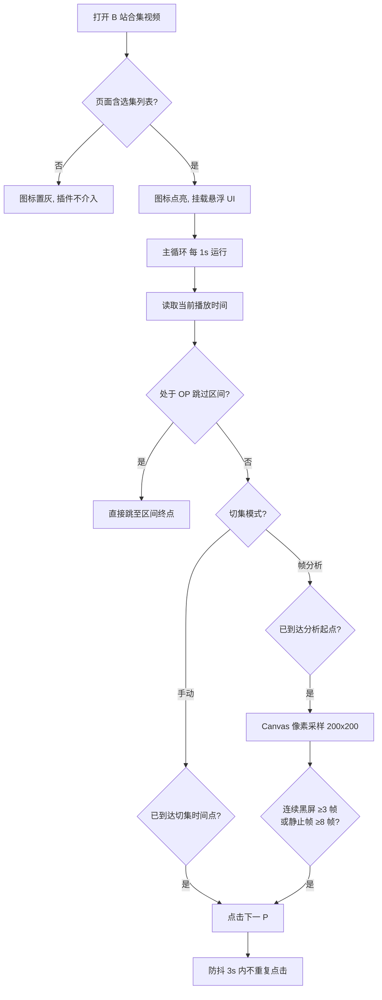
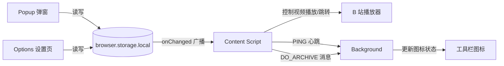

# BilibiliMovieControl（B 站连播助手）

> 一款针对 Bilibili（下称 B 站）**用户上传合集**的连播辅助浏览器插件。通过**像素级帧分析**与灵活的**双重存档机制**，自动跳过片头 / 片尾并切换下一 P，让你的追剧体验真正实现"无人值守"。


---

## 📑 目录

- [✨ 核心功能](#-核心功能)
- [🎯 适用范围说明](#-适用范围说明)
- [🚀 快速上手](#-快速上手)
- [🖥️ 界面总览](#️-界面总览)
- [⚙️ 工作原理](#️-工作原理)
- [🛠️ 技术架构](#️-技术架构)
- [💻 开发指南](#-开发指南)
- [📦 发布流程](#-发布流程)
- [❓ 常见问题](#-常见问题)
- [📄 项目说明](#-项目说明)

---

## ✨ 核心功能

### 1. OP / 先导跳过（多区间）

针对片头较长、内容固定的合集，可设置**多个跳过时间段**。当播放进度进入任一区间时，插件自动将进度跨越到区间终点。

- 支持添加 / 编辑 / 删除任意多个时间区间
- 例如：`0:00:00 → 0:05:00` 跳过片头，`0:06:00 → 0:06:30` 跳过中插广告

### 2. 切集模式（自动跳转下一 P）

提供两种切集逻辑，适配不同场景：

| 模式 | 原理 | 适用场景 | 注意事项 |
| --- | --- | --- | --- |
| **智能帧分析** | 到达设定起点后，通过 Canvas 对视频帧进行像素级采样，检测到**连续黑屏**或**长时间静止画面**（如演职员表）即自动点击"下一 P" | 美剧、电影片段等片尾有滚动字幕或黑屏的合集 | 纯黑画面可能误触发 |
| **手动切集** | 播放到设定时间点后**直接**切换下一 P | 每集时间点稳定的合集 | 若各集有删减，切集点可能不一致 |

> 两种模式下均可独立设置精确到秒的起始时间（时 / 分 / 秒）。

### 3. 多重存档机制

| 存档类型 | 触发方式 | 容量 | 恢复方式 |
| --- | --- | --- | --- |
| **最近播放（自动存档）** | 打开合集视频后由后台自动记录标题、URL 及全部时间参数 | 最多 **20 条** | 再次打开同一合集时一键还原配置 |
| **手动存档** | 在 Popup 中点击"手动存档"按钮 | 最多 **20 条** | 点击列表记录即可跳转并还原 |
| **快速访问** | — | Popup 展示最近 **2 条**自动记录 + **3 条**手动存档 | 点击即跳转 |

### 4. 状态指示

- **浏览器图标**：检测到当前页面为可处理的合集视频时图标为彩色（active），否则为灰色（inactive），随标签页切换实时更新
- **Popup 状态徽章**："已就绪 / 未启动"实时反映插件在当前页面的可用状态
- **页面悬浮提示**：视频标题栏下方显示跳过段数与当前切集起点，帧分析时闪烁指示点

---

## 🎯 适用范围说明

> [!IMPORTANT]
> **本插件仅针对 B 站用户上传的"合集"生效**（即播放器右侧显示有选集列表 `.video-pod` 的页面）。
>
> 对**电影、番剧正片、纪录片或普通单个视频页面无效**。

---

## 🚀 快速上手

1. **安装插件**（详见 [安装方式](#-安装方式)）
2. 打开任意 B 站**合集视频**（形如 `bilibili.com/video/BV...?p=1`）
3. 点击浏览器工具栏中的插件图标，打开 Popup：
   - 点击 **管理多个跳过时间段**，按需设置 OP / 先导跳过区间
   - 选择切集模式：**帧分析** 或 **手动切集**，并设置起始时间点
   - 设置完成后点击 **手动存档**，将当前配置存入长期档案
4. 回到播放页，配置即刻生效，无需刷新
5. 播放到片尾时，插件自动跳转下一 P，实现无人值守连播

---

## 🖥️ 界面总览

### Popup 弹窗

- 标题栏：插件名称 + 就绪状态徽章 + 「查看」入口（跳转设置页）
- **设置多 OP 跳转**：打开时间区间管理器（新增 / 修改 / 删除 / 重置）
- **设置视频集合跳转**：切换"帧分析 / 手动切集"模式，精确输入起始时间
- **重置**：一键清零当前模式的切集起点
- **最近播放**：显示最新 2 条自动存档，点击跳转
- **手动存档**：将当前配置保存为长期档案
- **手动存档列表**：显示最新 3 条，点击跳转

### Options 设置页（5 个选项卡）

| 选项卡 | 说明 |
| --- | --- |
| **功能讲解** | 功能介绍与使用示例（OP 跳转、切集模式、存档机制） |
| **状态设置** | 一键开关插件的合集自动处理（`isAutoHandle`） |
| **自动存档** | 管理最近播放记录：回看、单条删除、清空全部 |
| **手动存档** | 管理手动存档记录：回看、单条删除、清空全部 |
| **插件说明** | 技术栈、设计动机与已知局限说明 |

---

## ⚙️ 工作原理



**核心细节**

- **帧分析算法**（`utils/frameAnalyzer.ts`）：将视频帧绘制到 200×200 的 Canvas 上进行像素采样（步长 16px），通过亮度均值判断黑屏、前后帧像素差比例判断静止画面，需连续触发（黑屏约 3 秒 / 静止约 8 秒）才判定为片尾
- **检测节流**：进入分析区后每 200ms 采样一次；跳转操作 3s 防抖，避免误触
- **画中画保护**：PiP 模式下抓取的帧通常为黑屏，会自动跳过检测
- **自动存档**：页面加载完成后，后台 4s 延迟等待、URL 去重（保留 `?p=` 参数）后记录最新配置快照

---

## 🛠️ 技术架构

### 技术栈

| 类别 | 选型 |
| --- | --- |
| 扩展框架 | [WXT](https://wxt.dev)（Web Extension Toolbox，MV3） |
| UI 框架 | [SolidJS](https://www.solidjs.com) |
| 样式 | TailwindCSS 4 + [DaisyUI](https://daisyui.com)（自适应浏览器深浅色主题） |
| 图标 | Heroicons |
| 帧分析 | Canvas 像素采样（原生实现，无第三方依赖） |
| 构建工具 | Vite + Bun |

### 目录结构

```
BilibiliMovieControl/
├── entrypoints/
│   ├── background.ts          # 后台：自动/手动存档、图标状态管理、PING 心跳
│   ├── content.tsx            # 内容脚本：主控制循环、UI 挂载、跳转逻辑
│   ├── options/               # 设置页（含 5 个页面 + 路由）
│   │   ├── App.tsx            # 侧边栏布局
│   │   ├── router.ts
│   │   └── pages/             # Index / Status / History / Manual / About
│   └── popup/                 # 工具栏弹窗
├── components/                # 共享 UI 组件
│   ├── VideoUI.tsx            # 页面内悬浮状态条
│   ├── TimeInput.tsx          # 时:分:秒 输入组件
│   ├── TimeRangeList.tsx      # OP 跳转区间管理器
│   ├── HistoryList.tsx        # 存档记录列表
│   └── OptionsFooter.tsx
├── hooks/
│   └── useStorageConfig.ts    # 配置统一管理（createStore + storage 同步）
├── utils/
│   ├── bilibili.ts            # B 站工具：URL 清洗、合集标题、时间换算等
│   └── frameAnalyzer.ts       # 帧分析引擎（黑屏/静止画面检测）
├── types/types.ts             # 类型定义（TimePoint / TimeRange / 配置 / 历史记录）
├── public/icon/               # active / inactive 两套扩展图标
├── wxt.config.ts              # WXT 配置（MV3、权限、Edge/Firefox 适配）
└── package.json
```

### 数据流



- **配置存储**：`opRanges`、`frameConfig`、`jumpConfig`、`mode`、`isAutoHandle`、`isPageReady` 全部保存在 `storage.local`，任意端修改均通过 `storage.onChanged` 实时同步到内容脚本
- **历史记录**：`latestHistory`（自动，20 条）、`pinnedHistory`（手动，20 条）

---

## 💻 开发指南

### 环境要求

- [Bun](https://bun.sh) ≥ 1.x（包管理 / 构建）
- Node.js（WXT 依赖）

### 安装依赖

```bash
bun install
```

### 常用命令

| 命令 | 说明 |
| --- | --- |
| `bun dev` | 开发模式（Chrome，热更新） |
| `bun dev:edge` | 开发模式（Edge） |
| `bun dev:firefox` | 开发模式（Firefox） |
| `bun build` | 构建生产包（Chrome） |
| `bun build:firefox` | 构建 Firefox 包 |
| `bun compile` | TypeScript 类型检查（`tsc --noEmit`） |
| `bun zip` / `bun zip:firefox` | 生成发布用 zip 包 |

### 本地安装扩展（开发加载）

1. 运行 `bun build`（或 `bun dev`）
2. 浏览器进入扩展管理页：
   - Chrome / Edge：`chrome://extensions` / `edge://extensions`，开启"开发者模式"，选择「加载已解压的扩展程序」，指向 `.output/chrome-mv3`（或 `edge-mv3`）
   - Firefox：`about:debugging#/runtime/this-firefox`，选择「临时载入附加组件」，载入 `.output/firefox-mv3/manifest.json`
3. 打开任意 B 站合集视频验证效果

---

## 📦 发布流程

版本管理基于 [Changesets](https://github.com/changesets/changesets)，发布工作流见 `.github/workflows/release.yml`：

```bash
bun change     # 生成变更集
bun version    # 应用版本号并更新 CHANGELOG
bun run release # 构建 Firefox/Edge 包并提交到商店
```

- 推送 `package.json` 版本变更到 `main` 分支后，GitHub Actions 会自动构建并发布到 **Firefox Add-ons** 与 **Edge Add-ons**（需在仓库 Secrets 中配置对应商店密钥）
- 同时自动创建 GitHub Release，附带各浏览器 zip 与源码包

---

## ❓ 常见问题

**Q：打开合集视频后插件没有反应？**
A：确认 Popup 中状态徽章显示"已就绪"。若显示"未启动"，请刷新页面，并确认该视频确实是合集（右侧有选集列表）。

**Q：帧分析模式下黑屏 / 静止画面误触发跳转？**
A：纯黑画面（如场景切换）或长时间定格画面会触发判定。建议改用**手动切集**模式，设定精确时间点。

**Q：手动模式提前或延后跳转了？**
A：手动切集依赖每集的剪切点一致。若各集时长不一，可适当调整起始时间，或切换到帧分析模式。

**Q：切换标签页后图标仍是灰色？**
A：图标状态随当前活动标签页实时检测。停留片刻让后台完成 PING 检测即可。

**Q：刷新后之前的设置还在吗？**
A：在的。自动存档会在打开合集时恢复之前的 OP 跳转与切集配置；手动存档可随时点击恢复。

---

## 📄 项目说明

- **已知局限**：帧分析算法目前对"黑底白字演职员表"类片尾效果最好，纯黑画面可能误触；手动模式较依赖合集剪切点的整齐度
- 本项目仅供**学习与交流**使用，请勿用于任何商业用途
- © 2026 [BilibiliMovieControl](https://github.com/BilibiliMovieControl) 项目组
- 仓库地址：<https://github.com/sanguogege/BilibiliMovieControl>
